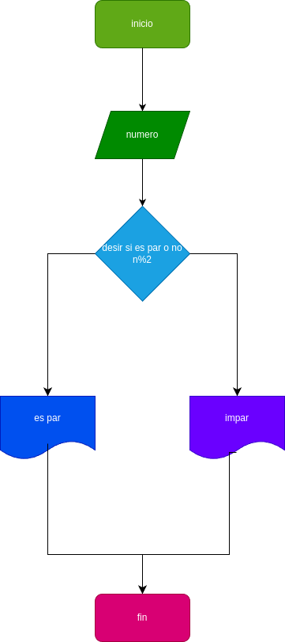

# Numero_Par_Impar
progama para saber si un numero es par o impar

## saber si un numero es par o impar

# analisis

## input

### variable de entrada

num : numero para saber si es par o impar

### processing
num % 2 = 0

num % 2 = 1

# DISEÑO

# construccion